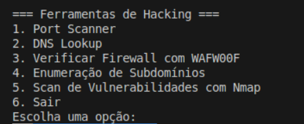

# HACK-APP
Projeto desenvolvido para a disciplina Tecnologias Hacker com o intuito de implementar ferramentas de hacking em um aplicativo via CLI.
Os arquivos example1.txt e example2.txt foram extraídos do repositório https://github.com/n0kovo/n0kovo_subdomains/tree/main.

## Manual do usuário:
Para executar o aplicativo, consulte o arquivo ```Documentação Técnica_ HACK-APP.md``` para verificar as dependências e instalações.

Para instalar as bibliotecas necessárias, execute o comando ```pip install -r requirements.txt``` no diretório raiz do projeto.

Uma vez realizados os passos acima, execute o comando ```python3 hack-app.py```. 

Após isso, o seguinte menu deve aparecer:



Após acessar esse menu, basta navegar e seguir as instruções de cada uma das funcionalidades disponibilizadas pelo aplicativo.